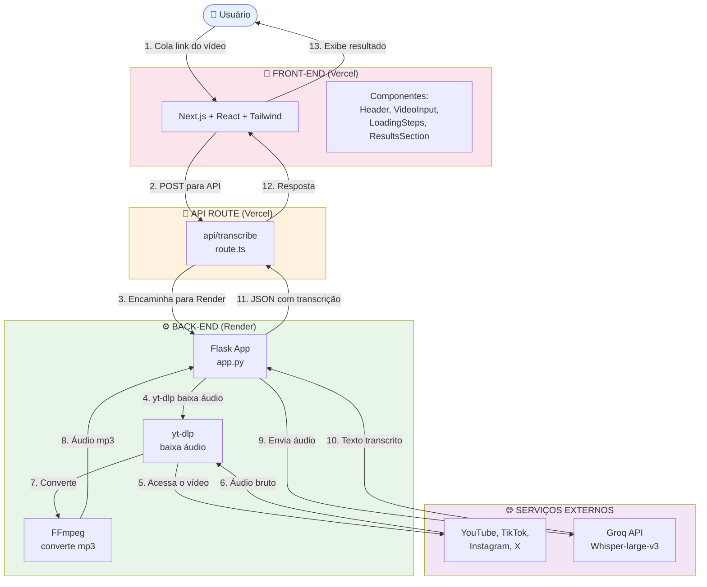
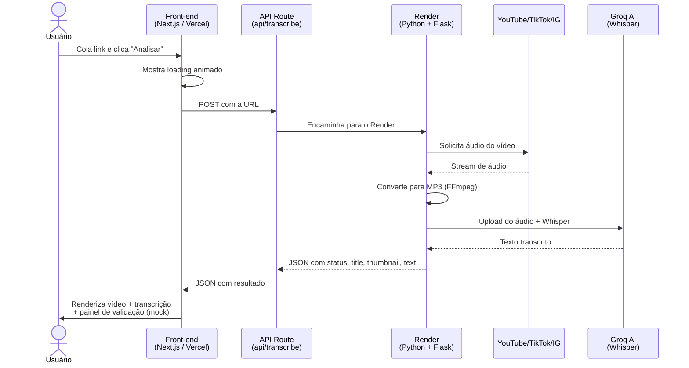
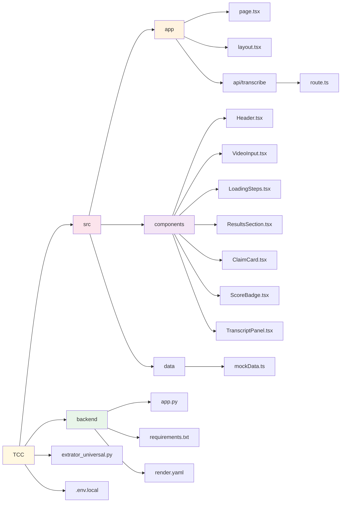
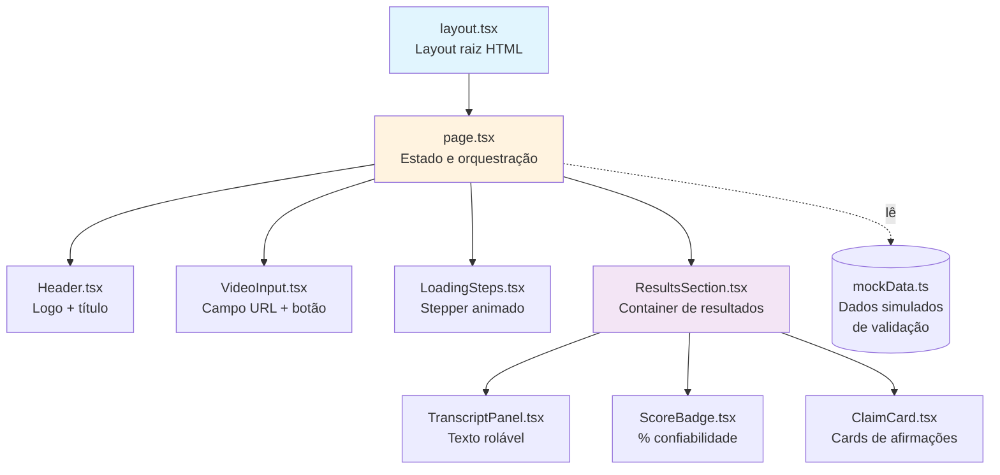
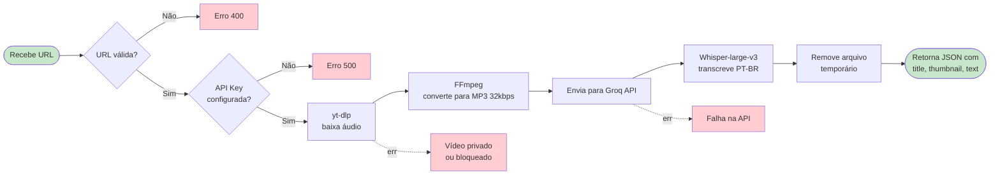
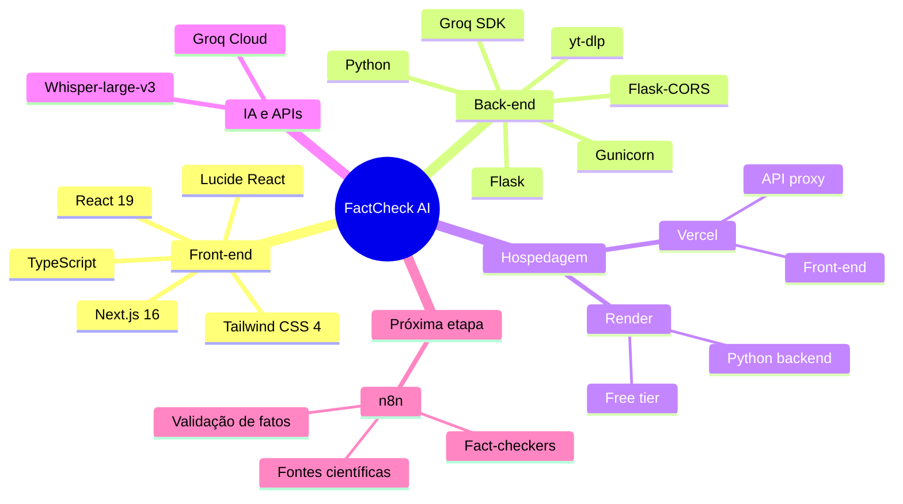
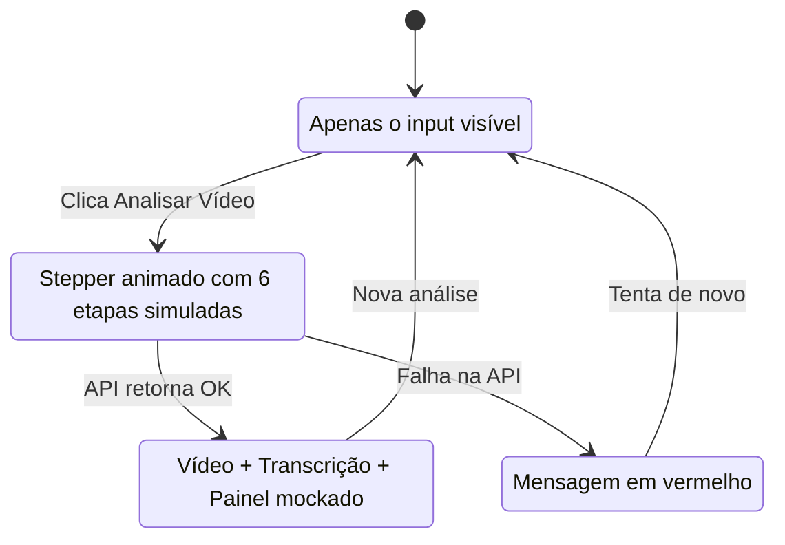

# Diagrama do Projeto — FactCheck AI

## 1. Arquitetura Geral

---

## 2. Fluxo de Dados (Sequência)

---

## 3. Estrutura de Arquivos

---

## 4. Componentes do Front-end

---

## 5. Pipeline do Back-end (Python)

---

## 6. Stack Técnica

---

## 7. Estados do Front-end

---

## Legenda de Cores

| Cor | Significado |
|-----|-------------|
| Rosa | Front-end (Vercel) |
| Verde | Back-end (Render) |
| Laranja | API/Proxy |
| Roxo | Serviços externos |
| Amarelo | Estrutura de arquivos |
