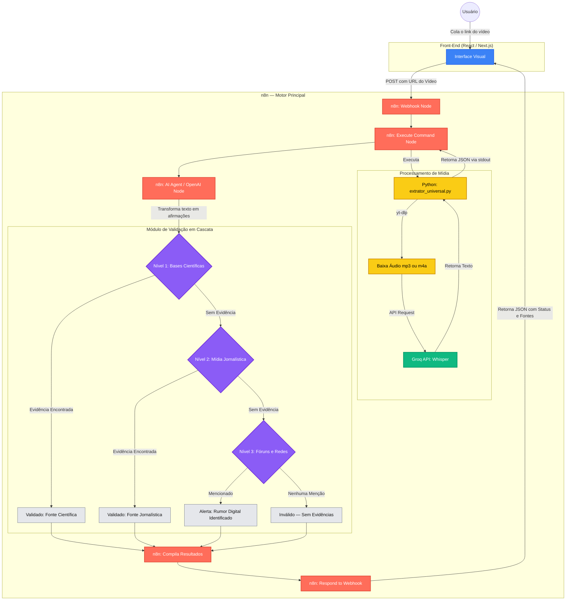

# Diagrama do Projeto — FactCheck AI

## Arquitetura Completa com Validação em Cascata

---

## Legenda de Cores

| Cor | Significado |
|-----|-------------|
| 🔵 Azul | Front-end (React / Next.js) |
| 🔴 Vermelho-coral | n8n (orquestração) |
| 🟡 Amarelo | Python (extrator universal) |
| 🟢 Verde | APIs externas (Groq / Whisper) |
| 🟣 Roxo | Módulos de busca em cascata |
| ⚪ Cinza | Resultados finais de validação |
