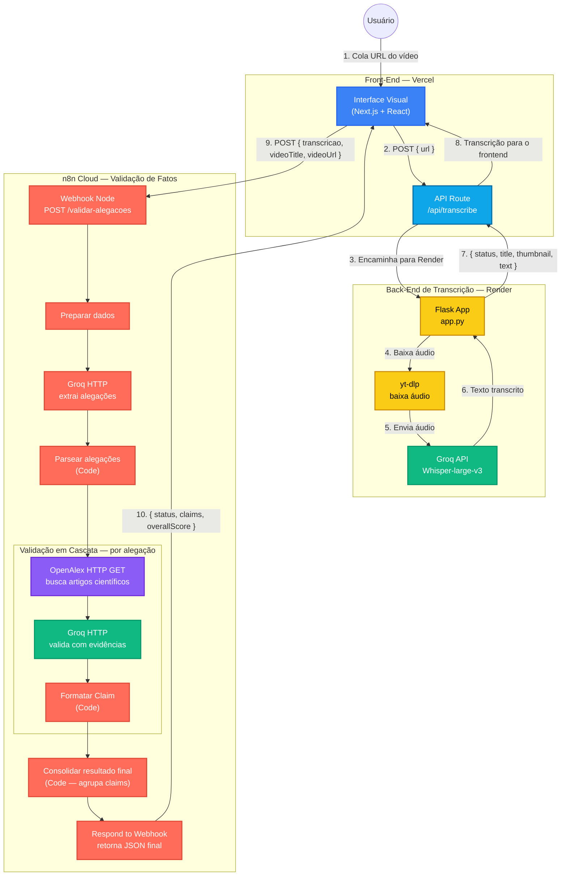

# Diagrama do Projeto — FactCheck KAI

## Arquitetura Atual (Integração Completa)

> Todas as linhas são sólidas — transcrição **e** validação via n8n estão integradas e funcionando.

---

## Fluxo de dados resumido

| Etapa | Entrada | Saída |
|-------|---------|-------|
| Frontend → `/api/transcribe` | `{ url }` | `{ status, title, thumbnail, text }` |
| Frontend → n8n webhook | `{ transcricao, videoTitle, videoUrl }` | `{ status, claims[], overallScore }` |
| Claim (n8n → frontend) | alegação + artigos OpenAlex | `{ id, text, status, veredicto, confianca, source, sourceLevel, fontes[] }` |

---

## Veredictos possíveis

| Veredicto | Status | Cor no frontend |
|-----------|--------|----------------|
| VERDADEIRO | validated | Verde |
| PARCIALMENTE VERDADEIRO | validated | Amarelo |
| FALSO | invalid | Vermelho |
| SEM EMBASAMENTO SUFICIENTE | invalid | Cinza |

---

## Legenda de Cores

| Cor | Significado |
|-----|-------------|
| Azul | Front-end (Next.js / React) |
| Azul claro | API Route da Vercel |
| Amarelo | Back-end Python (Render) |
| Verde | APIs externas (Groq / Whisper / Groq LLM) |
| Vermelho-coral | n8n (nós de orquestração) |
| Roxo | OpenAlex (busca científica) |
