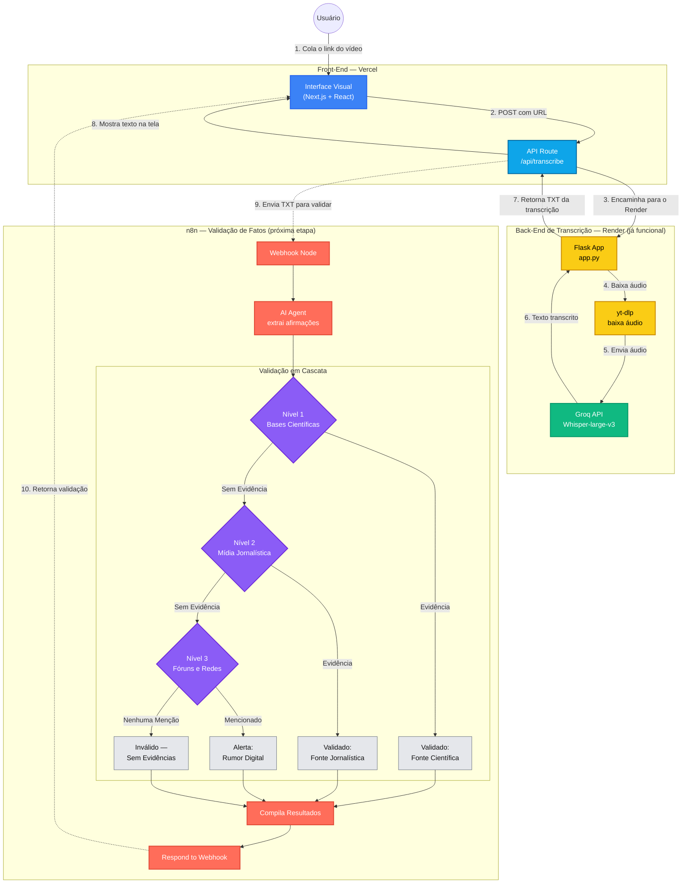

# Diagrama do Projeto — FactCheck AI

## Arquitetura Atual + Próxima Etapa (Validação via n8n)

> **Linhas sólidas** = fluxo atual de transcrição (já funcionando).
> **Linhas tracejadas** = fluxo planejado de validação via n8n (próxima etapa).

---

## Legenda de Cores

| Cor | Significado |
|-----|-------------|
| 🔵 Azul | Front-end (Next.js / React) |
| 🩵 Azul claro | API Route da Vercel |
| 🟡 Amarelo | Back-end Python (Render) |
| 🟢 Verde | API externa Groq / Whisper |
| 🔴 Vermelho-coral | n8n (futuro: validação) |
| 🟣 Roxo | Módulos de busca em cascata |
| ⚪ Cinza | Resultados finais de validação |
